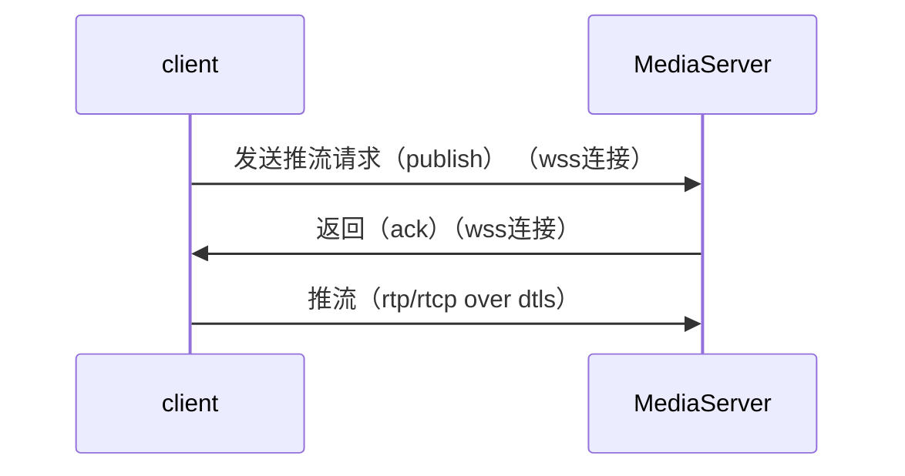
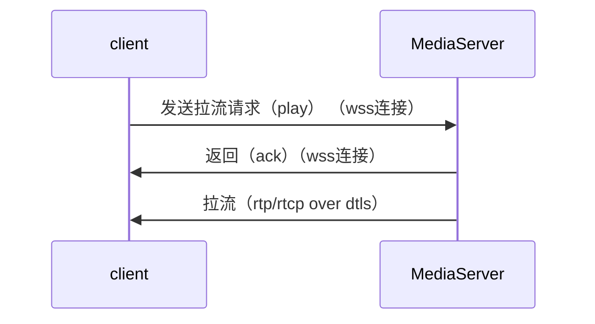

# 客户端与服务器交互流程

## 推流


## 拉流


# 客户端与媒体服务器的信令交互文档

## 说明

1. 当前媒体服务器与客户端之间的信令为四个：connect、offer、mute、close，
分别对应三种状态回应（on_result）：”connected“、”answer“、”muted“、”closed“。

## 公共头部分

***主动发起端信令的公共头部分***

|     Key     |  ValType  |  Value  |  Explain  |
| :---------: | :-------: | :-----: |:--------: |
| version     | string | 1.0 | 协议版本，1.0 |
| seq        | unsigned int | >= 0 | 客户端发送的请求cseq值需要逐条累加 |
| method      | string | publish/play/mute/close | 信令类型，目前有4种 |
| stream      | string | 流名 | 发布流的ID |

***示例：主动发起端公共头部分***

``` json
{
    "version": "1.0",
    "seq": 0,
    "method": "xxx",
    "stream": "xxx"
}
```

***对端回复信令的公共头部分***

|     Key     |  ValType  |   Value   |  Explain  |
| :---------: | :-------: | :-------: | :-------: |
| version     | string  | 1.0 | 协议版本，1.0 |
| seq        | unsigned int | >= 0 | 与客户端请求中的cseq值对应，表示此条回复针对的是哪条请求操作 |
| error       | int    | 0 或者 非0| 0 成功，非0失败 |
| result     | string | 任意字符串 | 对error的文字描述内容 |
| method      | string | publish/play/mute/close | 信令类型，目前有4种 |

***示例：对端回复信令的公共头部分***

``` json
{
    "version": "1.0",
    "seq": 0,
    "error": 0,
    "result": "success",
    "data": {
        ...
    }
}
```

## Publish （客户端发送SDP）

***publish 关键参数***

|     Key     |  ValType  |  Explain  |
| :---------: | :-------: | :-------: |
| sdp         | string | sdp内容 |

***publish 示例***

``` json
{
    "version": "1.0",
    "seq": 0,
    "method": "publish",
    "stream": "xxx",
    "data": {
        "sdp": "xxx"
    }
}
```

## Publish 响应（服务器发送SDP）

``` json
{
    "version": "1.0",
    "seq": 0,
    "error": 0,
    "result": "success",
    "method": "publish",
    "data": {
        "sdp": "xxx"
    }
}

```


## Play （客户端发送SDP）

***Play 关键参数***

|     Key     |  ValType  |  Explain  |
| :---------: | :-------: | :-------: |
| sdp         | string | sdp内容 |

***Play 示例***

``` json
{
    "version": "1.0",
    "seq": 1,
    "method": "play",
    "stream": "xxx",
    "data": {
        "sdp": "xxx"
    }
}
```

## Play 响应（服务器发送SDP）

``` json
{
    "version": "1.0",
    "seq": 1,
    "error": 0,
    "result": "success",
    "method": "play",
    "data": {
        "sdp": "xxx"
    }
}

```


## Mute （屏蔽视频或音频）

***mute 关键参数***

|     Key     |  ValType  |  Explain  |  Required |
| :---------: | :-------: | :-------: | :-------: |
| muteVideo   | bool     | false: 不屏蔽，true: 屏蔽 | 可选 |
| muteAudio   | bool     | false: 不屏蔽，true: 屏蔽 | 可选 |

***mute 示例***

``` json
{
    "version": "1.0",
    "seq": 2,
    "method": "mute",
    "stream": "xxx",
    "data": {
        "muteVideo": true,
        "muteAudio": true
    }
}

```

***mute 回复示例***

``` json
{
    "version": "1.0",
    "seq": 2,
    "error": 0,
    "result": "succeed",
    "method": "mute",
    "data": {
        "muteVideo": true,
        "muteAudio": true
    }
}
```

## Close（关闭流请求）

***示例：发起 close***

``` json

{
    "version": "1.0",
    "seq": 3,
    "method": "close",
    "stream": "xxxxx",
    "data": { }
}

```

***示例：回复 close***

``` json

{
    "version": "1.0",
    "seq": 3,
    "error": 2,
    "result": "succeed",
    "method": "close",
    "data":{ }
}

```
