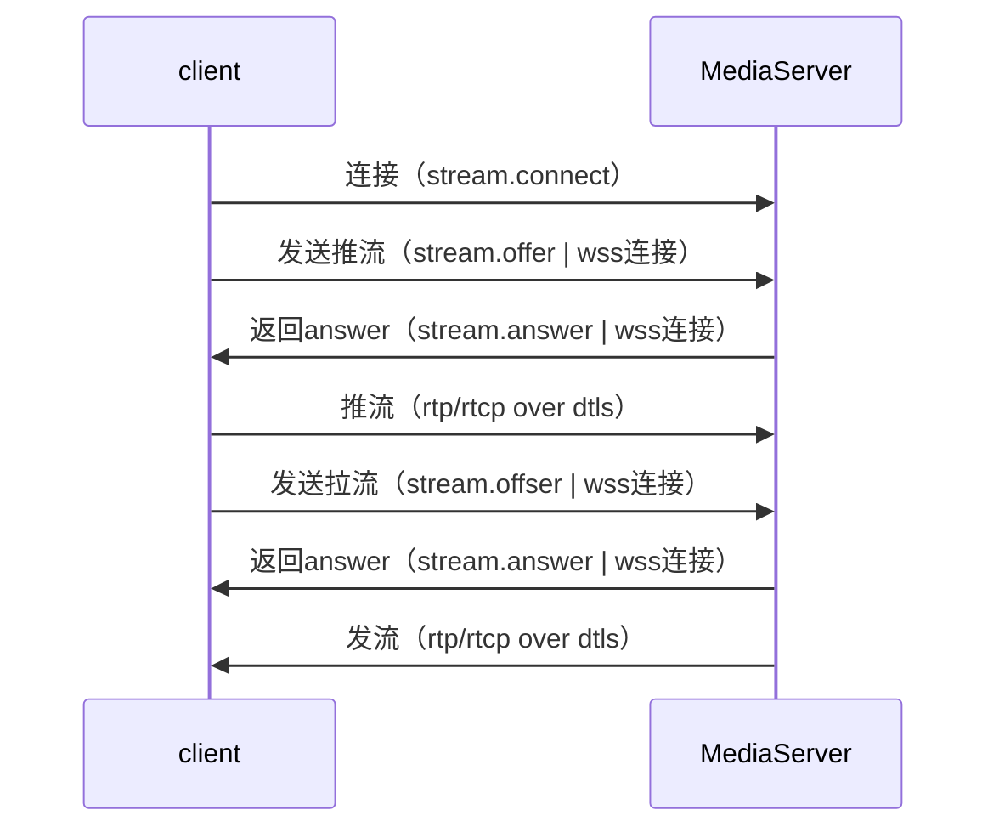

# 客户端与服务器交互流程



# 客户端与媒体服务器的信令交互文档

## 说明

1. 当前媒体服务器与客户端之间的信令为四个：connect、offer、mute、close，
分别对应三种状态回应（on_result）：”connected“、”answer“、”muted“、”closed“。

## 公共头部分

***主动发起端信令的公共头部分***

|     Key     |  ValType  |  Value  |  Explain  |
| :---------: | :-------: | :-----: |:--------: |
| version     | string | 1.0 | 协议版本，1.0 |
| method      | string | offer/mute/close | 信令类型，目前有三种 |
| app         | string | 挂载点 | 用于区分不同开发者（企业客户）旗下的用户 |
| uid         | string | 用户ID | 从属于app的用户的ID |
| stream      | string | 流名 | 发布流的ID |

***示例：主动发起端公共头部分***

``` json
{
    "version": "1.0",
    "method": "xxx",
    "app": "xxx",
    "uid": "xxx",
    "stream": "xxx"
}
```

***对端回复信令的公共头部分***

|     Key     |  ValType  |   Value   |  Explain  |
| :---------: | :-------: | :-------: | :-------: |
| version     | string  | 1.0 | 协议版本，1.0 |
| err         | int    | 0 或者 非0| 0 成功，非0失败 |
| err_msg     | string | 任意字符串 | 对err的文字描述内容 |
| method      | string | ack | 回复信令 必须是 ack |
| on_result   | string | answer/muted/closed | 回复端状态，目前有三种 |
| uid         | string | 用户ID | 用户ID |
| stream      | string | 流名 | 发布流的ID |

***示例：对端回复信令的公共头部分***

``` json
{
    "version": "1.0",
    "err": 0,
    "err_msg": "success",
    "method": "ack",
    "on_result": "xxx",
    "app": "xxx",
    "uid": "xxx",
    "stream": "xxx"
}
```

## Connect （客户端发送token）

***offer 关键参数***

|     Key     |  ValType  |  Explain  |
| :---------: | :-------: | :-------: |
| token       | string | 鉴权token |

***Connect 示例***

``` json
{
    "version": "1.0",
    "method": "stream.connect",
    "app": "xxx",
    "uid": "xxx",
    "stream": "xxx",
    "data": {
        "token": "xxx"
    }
}
```

## Connected

***Connected 关键参数***

|     Key     |  ValType  |  Explain  |
| :---------: | :-------: | :-------: |

***answer 示例***

``` json
{
    "version": "1.0",
    "err": 0,
    "err_msg": "success",
    "method": "ack",
    "on_result": "stream.connected",
    "app": "xxx",
    "uid": "xxx",
    "stream": "xxx",
    "data": {
    }
}

```

## Offer （客户端发送SDP）

***offer 关键参数***

|     Key     |  ValType  |  Explain  |
| :---------: | :-------: | :-------: |
| publish     | bool    | true 发布请求，false 播放请求 |
| sdp         | string | sdp内容 |

***offer 示例***

``` json
{
    "version": "1.0",
    "method": "stream.offer",
    "app": "xxx",
    "uid": "xxx",
    "stream": "xxx",
    "data": {
        "publish": true,
        "sdp": "xxx"
    }
}
```

## Answer（服务器发送SDP）

***answer 关键参数***

|     Key     |  ValType  |  Explain  |
| :---------: | :-------: | :-------: |
| sdp         | string | sdp内容 |

***answer 示例***

``` json
{
    "version": "1.0",
    "err": 0,
    "err_msg": "success",
    "method": "ack",
    "on_result": "stream.answer",
    "app": "xxx",
    "uid": "xxx",
    "stream": "xxx",
    "data": {
        "publish": true,
        "sdp": "xxx"
    }
}

```

## Mute （屏蔽视频或音频）

***mute 关键参数***

|     Key     |  ValType  |  Explain  |  Required |
| :---------: | :-------: | :-------: | :-------: |
| video       | bool     | false: 不屏蔽，true: 屏蔽 | 可选 |
| audio       | bool     | false: 不屏蔽，true: 屏蔽 | 可选 |

***mute 示例***

``` json
{
    "version": "1.0",
    "method": "stream.mute",
    "app": "xxx",
    "uid": "xxx",
    "stream": "xxx",
    "data": {
        "video": false,
        "audio": false
    }
}

```

***mute 关键参数***

|     Key     |  ValType  |  Explain  |  Required |
| :---------: | :-------: | :-------: | :-------: |
| video       | bool     | false: 当前不屏蔽，true: 当前已屏蔽 | 必选 |
| audio       | bool     | false: 当前不屏蔽，true: 当前已屏蔽 | 必选 |

***mute 回复示例***

``` json
{
    "version": "1.0",
    "err": 0,
    "err_msg": "succeed",
    "method": "ack",
    "on_result": "stream.muted",
    "app": "xxx",
    "uid": "xxx",
    "stream": "xxx",
    "data": {
        "video": false,
        "audio": false
    }
}
```

## Close（关闭流请求）

***关键参数：客户端发起 close***

***无私有参数***

|     Key     |  ValType  |  Explain  |
| :---------: | :-------: | :-------: |
|    |  |  |

***示例：发起 close***

``` json

{
    "version": "1.0",
    "method": "stream.close",
    "app": "xxx",
    "uid": "xxx",
    "stream": "xxxxx",
    "data": { }
}

```

***示例：回复 close***

``` json

{
    "version": "1.0",
    "err": 0,
    "err_msg": "succeed",
    "method": "ack",
    "on_result": "stream.closed",
    "app": "xxx",
    "uid": "xxx",
    "stream": "xxxxx",
    "data":{ }
}

```
