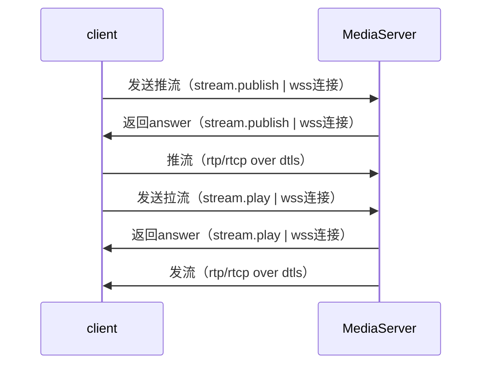

# 编译安装

## 1. 编译过程

```bash
make && make master
```

## 2. 生成安装包

```bash
./rpm.sh 1.0.1 pms
```

## 2. 修改配置

```json
{
    "log": {
        "file": "./logs/pms.log",
        "workerLevel": "debug",
        "fileLevel": "debug",
        "consolLevel": "debug",
        "workerTags": ["info", "ice", "dtls", "rtp", "srtp", "rtcp", "rtx", "bwe", "score", "simulcast", "svc", "sctp", "message"]
    },

    "websocket": {
        "port": 8889,
        "ssl": true,
        "keyFile": "./certs/privkey.pem",
        "certFile": "./certs/full_chain.pem",
        "passPhrase": "",
        "location": "/"
    },

    "master": {
        "numOfWorkerProcess": 0,
        "execPath": "./",
        "workerName": "mediasoup-worker",
        "unixSocketPath": "./logs/pms"
    },

    "webrtc": {
        "listenIp": "172.17.0.17",
        "announcedIp": "122.51.177.240",
        "minPort": 20000,
        "maxPort": 30000,
        "dtlsCertificateFile": "./certs/full_chain.pem",
        "dtlsPrivateKeyFile": "./certs/privkey.pem"
    },

    "rtsp": {
        "port": 8554,
        "listenIp": "0.0.0.0"
    },

    "record": {
        "targetHost": "127.0.0.1",
        "targetPort": 8554,
        "recordPath": "./record/",
        "execRecordDone": "",
        "cmdPort": 8888
    },

    "pull":
        [
            {"ip": "xxx", "port": 8554},
            {"ip": "xxx", "port": 8554}
        ]
}

```
主要配置项：

- los
    - file：日志文件路径
    - workerLevel：子进程的日志等级，如"debug"/"warn"/"error"
    - fileLevel：输出到文件的日志等级，如"debug"/"info"/"warn"/"error"
    - consolLevel：输出到控制台的日志等级，如"debug"/"info"/"warn"/"error"
    - workerTags：子进程的日志标记，如果["info", "ice", "dtls", "rtp", "srtp", "rtcp", "rtx", "bwe", "score", "simulcast", "svc", "sctp", "message"]

- websocket
    - port：wss端口
    - ssl：是否使用ssl
    - keyFile：证书私钥文件
    - cerFile：证书文件
    - passPhrase：证书认证密码
    - location：wss的uri路径

- master
    - numOfWorkerProcess：子进程个数，如果为0则与CPU核数量一致
    - execPath：指定运行目录
    - workerName：子进程文件名
    - unixSocketPath：`目前已经弃用该配置`

- webrtc
    - listenIp：监听网卡的ip
    - announcedIp：对外服务的公网ip
    - minPort：udp端口范围的最小值
    - maxPort：udp端口范围的最大值
    - dtlsCertificateFile: 证书文件
    - dtlsPrivateKeyFile：证书私钥

- rtsp
    - port：rtsp服务器端口
    - listenIp：监听IP

- record
    - targetHost: 需要被录制的服务器ip，如果想对本服务器录制 则设置为：127.0.0.1
    - targetPort: 需要被录制的服务器rtsp端口
    - recordPath: 录制文件存储目录
    - execRecordDone: 录制文件生成后如果还需要做后续的处理则在此处填写shell命令
    - cmdPort: 录制控制端口

- pull
    - ip: 需要互联的sfu ip
    - port: 需要互联的sfu port


# 信令部分

# 1. 客户端与服务器交互流程



# 2. 客户端与媒体服务器的信令交互文档

## 2.1 说明

- 当前媒体服务器与客户端之间的信令为四个：stream.publish、stream.play、stream.mute、stream.close。

## 2.2 公共头部分

***主动发起端信令的公共头部分***

|     Key     |  ValType  |  Value  |  Explain  |
| :---------: | :-------: | :-----: |:--------: |
| version     | string | 1.0 | 协议版本，1.0 |
| method      | string | stream.publish、stream.play、stream.mute、stream.close | 信令类型，目前有4种 |
| stream      | string | 流名 | 发布流的ID |

***示例：主动发起端公共头部分***

``` json
{
    "version": "1.0",
    "method": "xxx",
    "stream": "xxx"
}
```

***对端回复信令的公共头部分***

|     Key     |  ValType  |   Value   |  Explain  |
| :---------: | :-------: | :-------: | :-------: |
| version     | string  | 1.0 | 协议版本，1.0 |
| err         | int    | 0 或者 非0| 0 成功，非0失败 |
| err_msg     | string | 任意字符串 | 对err的文字描述内容 |
| method      | string | ack | 回复信令 必须是 ack |

***示例：对端回复信令的公共头部分***

``` json
{
    "version": "1.0",
    "err": 0,
    "err_msg": "success",
    "method": "xxx",
}
```

## 2.3 stream.publish （客户端发送SDP）

### 2.3.1 客户端请求
***stream.publish 关键参数***

|     Key     |  ValType  |  Explain  |
| :---------: | :-------: | :-------: |
| sdp         | string | sdp内容 |

***stream.publish 示例***

``` json
{
    "version": "1.0",
    "method": "stream.publish",
    "uid": "xxx",
    "stream": "xxx",
    "data": {
        "sdp": "xxx"
    }
}
```

### 2.3.2 服务器响应（服务器发送SDP）

***answer 关键参数***

|     Key     |  ValType  |  Explain  |
| :---------: | :-------: | :-------: |
| sdp         | string | sdp内容 |

***answer 示例***

``` json
{
    "version": "1.0",
    "err": 0,
    "err_msg": "success",
    "method": "stream.publish",
    "data": {
        "sdp": "xxx"
    }
}

```

## 2.4 stream.play （客户端发送SDP）

### 2.4.1 客户端请求
***stream.play 关键参数***

|     Key     |  ValType  |  Explain  |
| :---------: | :-------: | :-------: |
| sdp         | string | sdp内容 |

***stream.play 示例***

``` json
{
    "version": "1.0",
    "method": "stream.play",
    "stream": "xxx",
    "data": {
        "sdp": "xxx"
    }
}
```

### 2.4.2 服务器响应（服务器发送SDP）

***answer 关键参数***

|     Key     |  ValType  |  Explain  |
| :---------: | :-------: | :-------: |
| sdp         | string | sdp内容 |

***answer 示例***

``` json
{
    "version": "1.0",
    "err": 0,
    "err_msg": "success",
    "method": "stream.play",
    "data": {
        "sdp": "xxx"
    }
}

```

## 2.5 stream.mute （屏蔽视频或音频）

### 2.5.1 客户端请求

***mute 关键参数***

|     Key     |  ValType  |  Explain  |  Required |
| :---------: | :-------: | :-------: | :-------: |
| video       | bool     | false: 不屏蔽，true: 屏蔽 | 可选 |
| audio       | bool     | false: 不屏蔽，true: 屏蔽 | 可选 |

***mute 示例***

``` json
{
    "version": "1.0",
    "method": "stream.mute",
    "stream": "xxx",
    "data": {
        "video": false,
        "audio": false
    }
}

```

### 2.5.3 服务器响应

***mute 关键参数***

|     Key     |  ValType  |  Explain  |  Required |
| :---------: | :-------: | :-------: | :-------: |
| video       | bool     | false: 当前不屏蔽，true: 当前已屏蔽 | 必选 |
| audio       | bool     | false: 当前不屏蔽，true: 当前已屏蔽 | 必选 |

***mute 回复示例***

``` json
{
    "version": "1.0",
    "err": 0,
    "err_msg": "succeed",
    "method": "stream.mute",
    "data": {
        "video": false,
        "audio": false
    }
}
```

## 2.6 stream.close（关闭流请求）

### 2.6.1 客户端请求

***关键参数：客户端发起 close***

***无私有参数***

|     Key     |  ValType  |  Explain  |
| :---------: | :-------: | :-------: |
|    |  |  |

***示例：发起 close***

``` json

{
    "version": "1.0",
    "method": "stream.close",
    "stream": "xxxxx",
    "data": { }
}

```

### 2.6.2 服务器响应

***示例：回复 close***

``` json

{
    "version": "1.0",
    "err": 0,
    "err_msg": "succeed",
    "method": "stream.close",
    "data":{ }
}

```

## 2.7 stream.heartbeat 心跳

### 2.7.1 请求

```json
{
    "version": "1.0",
    "method": "stream.heartbeat",
    "stream": "xxx",
    "data": { }
}
```

### 2.7.1 返回

```json
{
    "version": "1.0",
    "err": 0,
    "err_msg": "succeed",
    "method": "stream.heartbeat",
    "data":{ }
}
```

# 3. 录制

## 开始录制

```json
{
    "stream": "123456",
    "method":"record.start",
    "data": {
        "fileName": "123456-20201123-231523.webm"
    }
}
```

## 停止录制

```json
{
    "stream": "123456",
    "method":"record.stop",
    "data": {}
}
```
